# Smart Study Planner 智慧学习计划平台

基于 Vue 3 + Spring Boot 的智能学习计划平台，支持用户注册登录、AI 生成学习计划、每日任务打卡、学习统计、论坛问答、群组学习计划、AI 助手和实时聊天室，本科生用于毕业设计的，如果有用的话麻烦点个小心心，感谢各位

## 项目结构

```text
study_planner/
├── study-planner-frontend-main/   # 前端项目，Vue 3 + Vite
├── study_planner-main/            # 后端项目，Spring Boot + MyBatis
└── start-all.bat                  # 同时启动前后端
```

## 功能概览

- 用户系统：注册、登录、退出、资料维护、头像上传、密码修改、管理员用户管理。
- 学习计划：目标分析、目标优化、路线图生成、计划生成、计划编辑、拖拽排期、版本恢复、状态更新和删除。
- 群组计划：公开/邀请制计划、邀请码加入、成员管理、个人副本。
- 学习打卡：每日任务打卡、连续打卡、学习统计、图表数据和日历数据。
- AI 助手：基于大模型的学习问答和计划生成，支持 mock 模式。
- 学习论坛：问题发布、回答、评论、话题、点赞、收藏、关注、搜索、我的内容和论坛统计。
- 实时聊天室：基于 WebSocket/STOMP 的全局聊天室与计划聊天室。

## 技术栈

前端：Vue 3、Vite、Vue Router、Pinia、Axios、Bootstrap 5、Bootstrap Icons、ECharts、vue-i18n、SockJS、STOMP、Marked、Highlight.js、Cropper.js。

后端：Java 17、Spring Boot 3.2、Spring Web、Spring Security、Spring WebSocket、MyBatis、MySQL、Lombok、Fastjson2、OkHttp。

## 环境要求

- JDK 17+
- Maven 3.8+
- Node.js 18+ 和 npm
- MySQL 8.x

## 后端配置

后端配置文件：

```text
study_planner-main/src/main/resources/application.yml
```

启动前至少检查下面几项：

```yaml
server:
  port: 8080

spring:
  datasource:
    url: jdbc:mysql://localhost:3306/study_planner?useUnicode=true&characterEncoding=utf-8&serverTimezone=Asia/Shanghai&useSSL=false&allowPublicKeyRetrieval=true
    username: root
    password: 你的数据库密码

llm:
  api:
    provider: dashscope
    base-url: https://dashscope.aliyuncs.com/compatible-mode/v1
    api-key: 你的大模型 API Key
    model: qwen-turbo
    mock-mode: true
```

请根据自己的本机环境修改数据库用户名、密码和大模型 API Key。本地演示时可以保持 `mock-mode: true`，这样不用真实大模型 Key 也能体验主要流程；需要接入真实模型时再填入自己的 `api-key` 并把 `mock-mode` 改为 `false`。数据库密码、API Key 这类敏感信息不要提交到公开仓库。

## 数据库初始化

SQL 脚本位于：

```text
study_planner-main/sql/init.sql
```

全新数据库环境只需要执行一个初始化文件：

```bash
mysql --default-character-set=utf8mb4 -u root -p < study_planner-main/sql/init.sql
```

说明：

- `init.sql` 会创建 `study_planner` 数据库，并重建用户、学习计划、计划任务、计划成员、打卡、AI 对话、聊天室、论坛、计划工作台版本快照和统计视图。
- `init.sql` 是初始化/重置脚本，会删除并重建项目表。已有数据的库不要直接执行，应该先备份或改成迁移脚本。

## 启动项目

一键启动前后端：

```bat
start-all.bat
```

也可以分别启动。

启动后端：

```bash
cd study_planner-main
mvn spring-boot:run
```

或者双击：

```text
study_planner-main/start-backend.bat
```

后端默认地址：

```text
http://localhost:8080
```

启动前端：

```bash
cd study-planner-frontend-main
npm install
npm run dev
```

或者双击：

```text
study-planner-frontend-main/start-frontend.bat
```

前端开发服务通常运行在：

```text
http://localhost:5174
```

如果端口被占用，Vite 会自动换到下一个可用端口，以终端输出为准。前端通过 Vite 代理访问后端：

- `/api` -> `http://localhost:8080`
- `/uploads` -> `http://localhost:8080`

## 构建前端

```bash
cd study-planner-frontend-main
npm run build
```

构建产物会生成到：

```text
study-planner-frontend-main/dist/
```

## 主要接口模块

后端接口统一以 `/api` 开头：

- `/api/user`：用户注册、登录、退出、用户信息、资料更新、头像上传。
- `/api/admin`：管理员用户、话题、问题、回答、评论审核管理。
- `/api/plan`：模型列表、目标分析、计划生成、计划管理、群组计划、计划工作台、版本恢复。
- `/api/checkin`：学习打卡、今日记录、连续打卡、统计和图表数据。
- `/api/ai`：AI 聊天接口。
- `/api/forum`：论坛问题、回答、评论、话题、搜索、用户主页和我的内容。
- `/api/chat`：聊天室历史消息和在线用户。
- `/api/chat/ws`：聊天室 WebSocket/STOMP 入口。

## 常见问题

### 前端请求 404 或无法连接后端

确认后端已启动在 `http://localhost:8080`，并检查 `study-planner-frontend-main/vite.config.js` 中的代理配置。

### 数据库连接失败

确认 MySQL 服务已启动，`study_planner` 数据库已初始化，并检查 `application.yml` 中的数据库用户名、密码、端口和库名。

### AI 生成失败

检查 `llm.api.api-key`、`base-url` 和 `model` 是否可用。如果只是本地演示，可以先启用 `mock-mode: true`。

### 头像上传后无法访问

检查 `file.upload.path` 和 `file.upload.url-prefix` 配置。默认上传目录为后端项目下的 `uploads`，访问前缀为 `/uploads`。

### 想创建管理员账号

先正常注册一个用户，再在数据库里把该用户角色改为管理员：

```sql
UPDATE user SET role = 'admin' WHERE username = '你的用户名';
```

## 开发建议

- 新环境先执行数据库初始化，再启动后端和前端。
- 后端默认保持 `8080` 端口，方便前端代理配置复用。
- 不要提交 `node_modules/`、`target/`、日志文件、本地上传文件和真实密钥。
- 生产环境建议通过 Nginx 等反向代理统一转发前端静态资源、`/api` 和 `/uploads`。

## 项目运行截图

### 首页


### 登录页
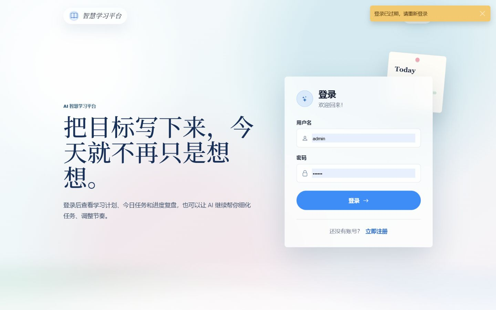

### 注册页
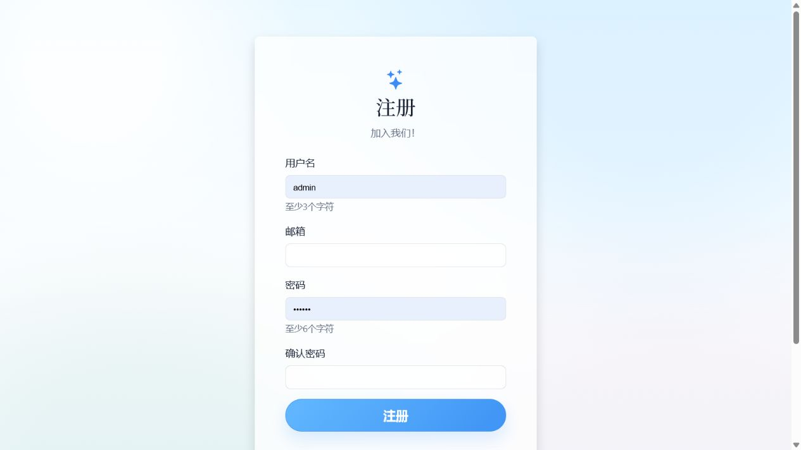

### 仪表盘
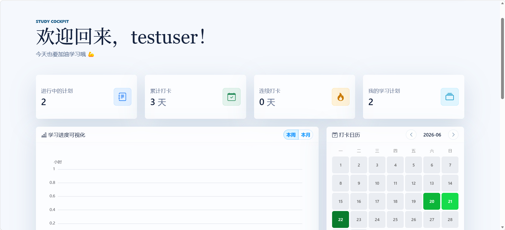

### 创建计划
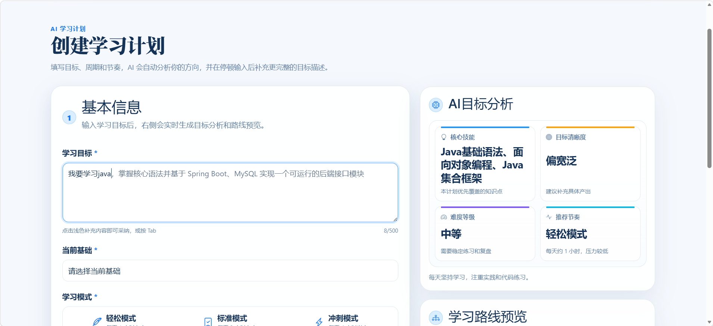

### 我的计划
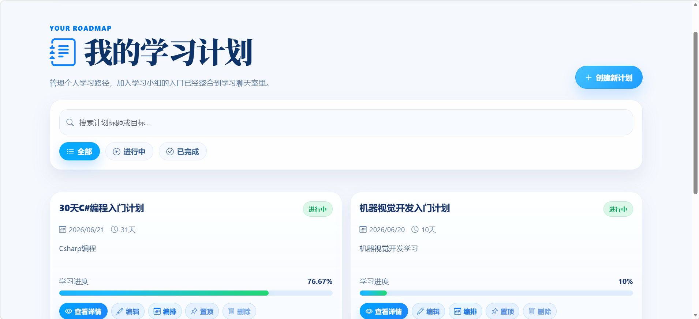

### 计划详情
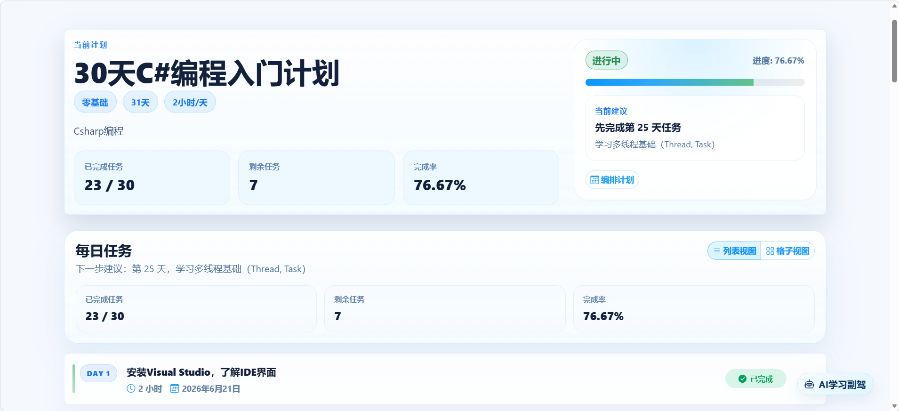

### 计划工作台
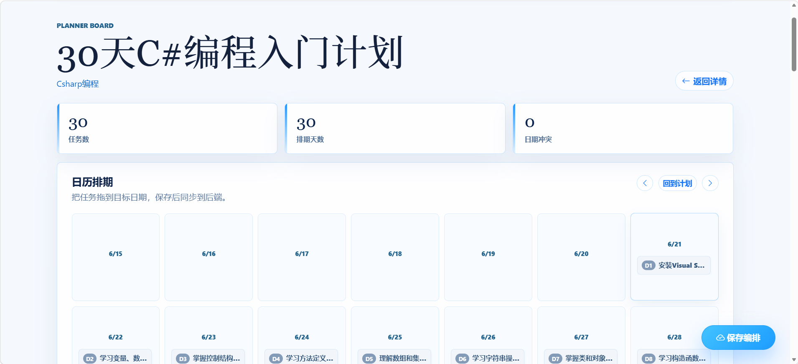

### AI 学习助手
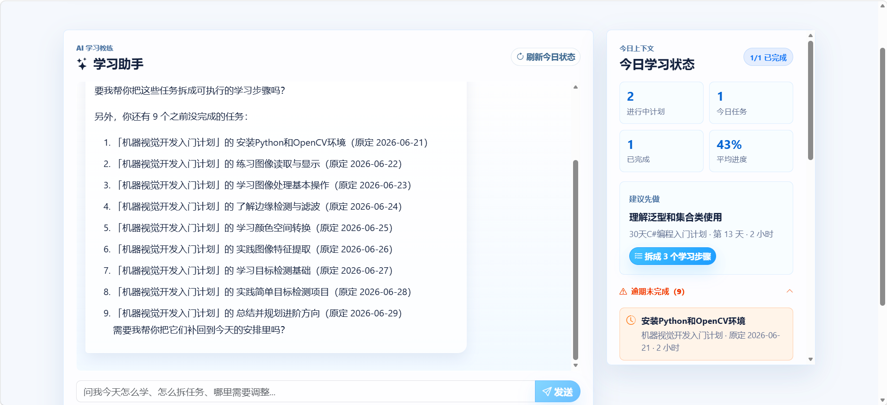

### 学习论坛
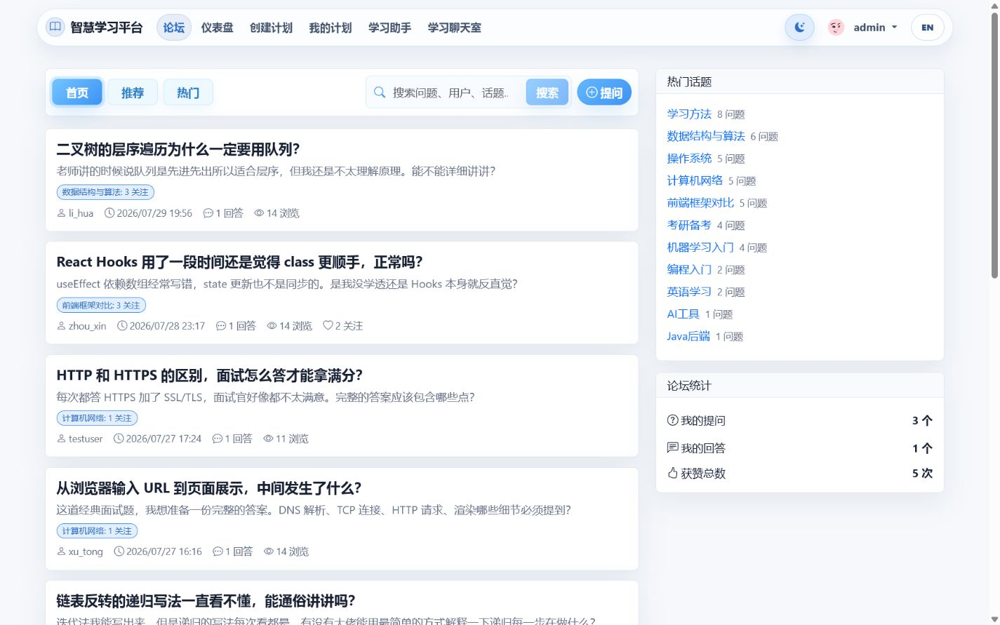

### 问题详情
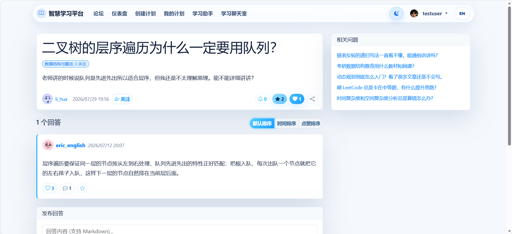

### 发布问题
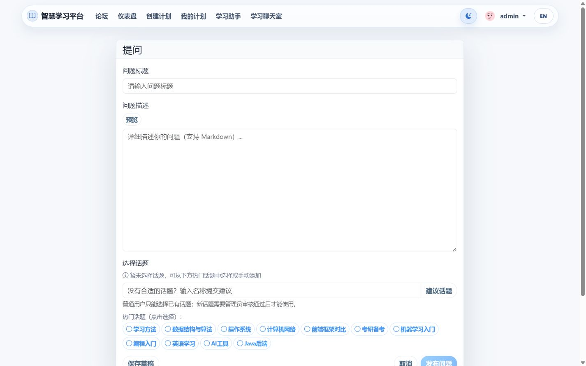

### 话题页面
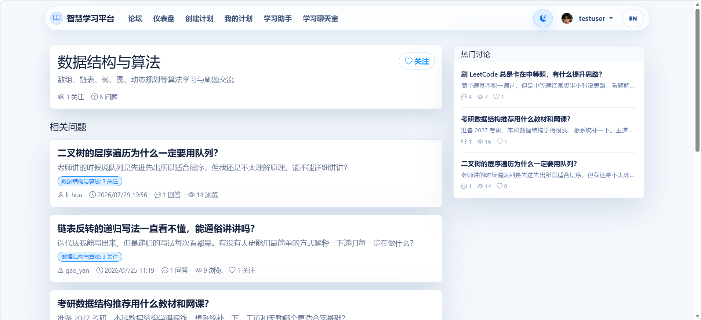

### 用户主页
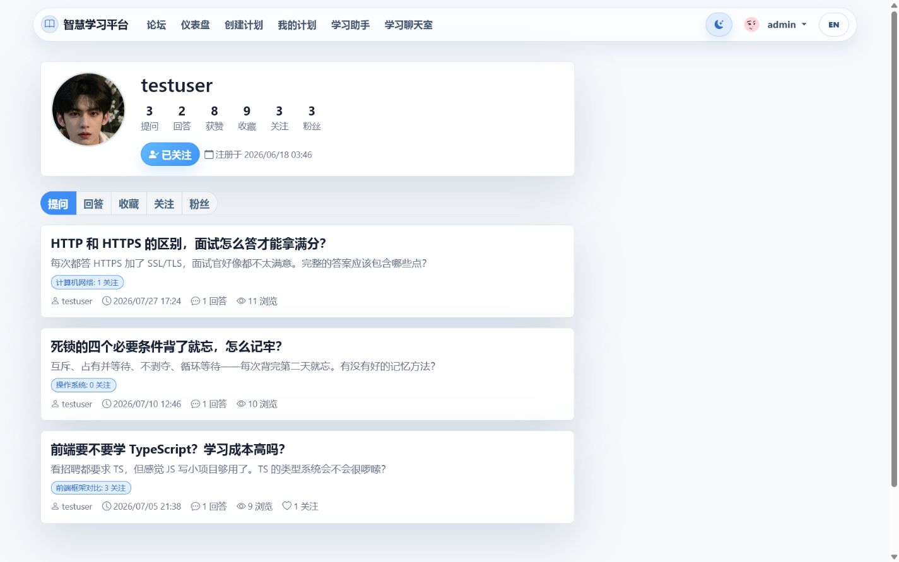

### 论坛搜索
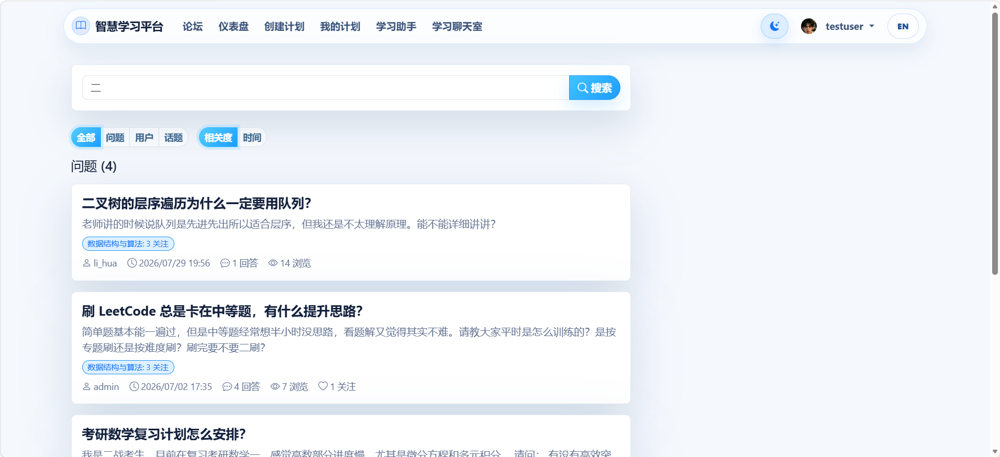

### 我的内容
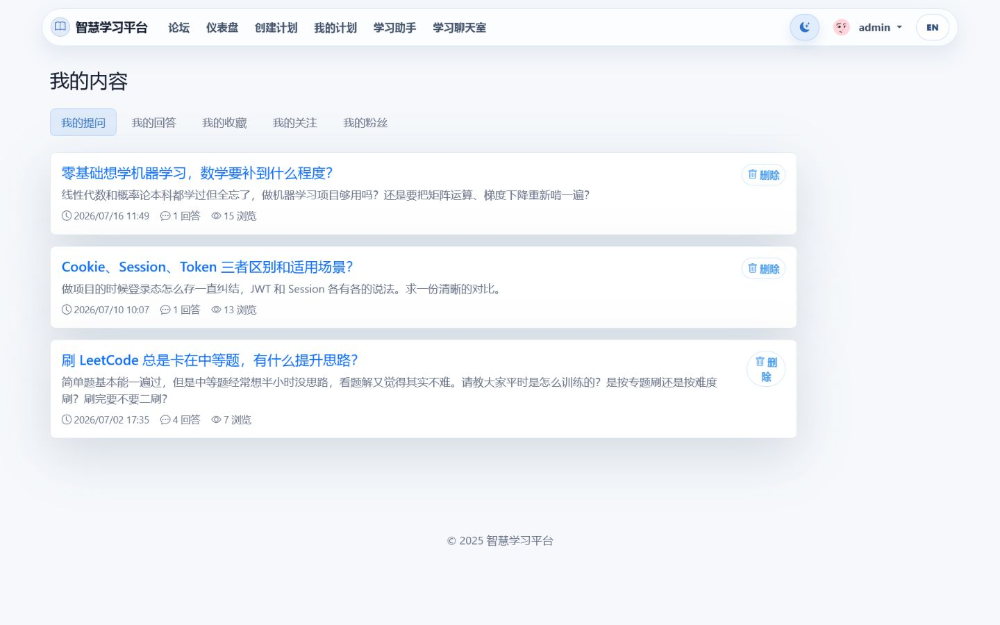

### 实时聊天
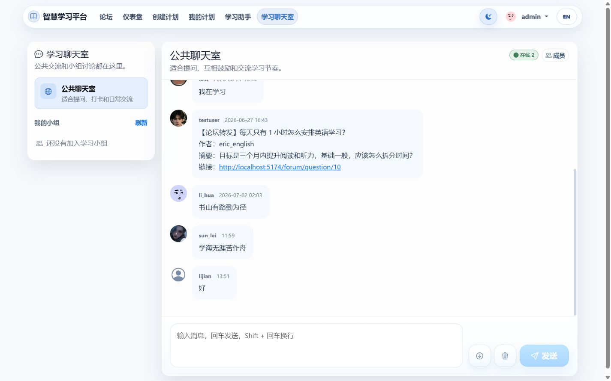

### 个人资料
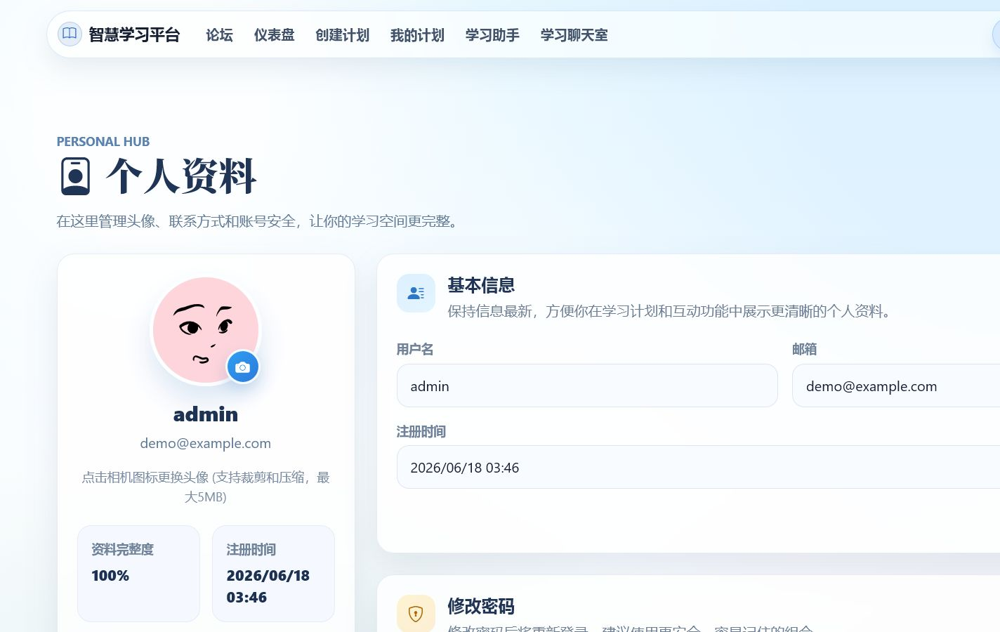

### 管理后台
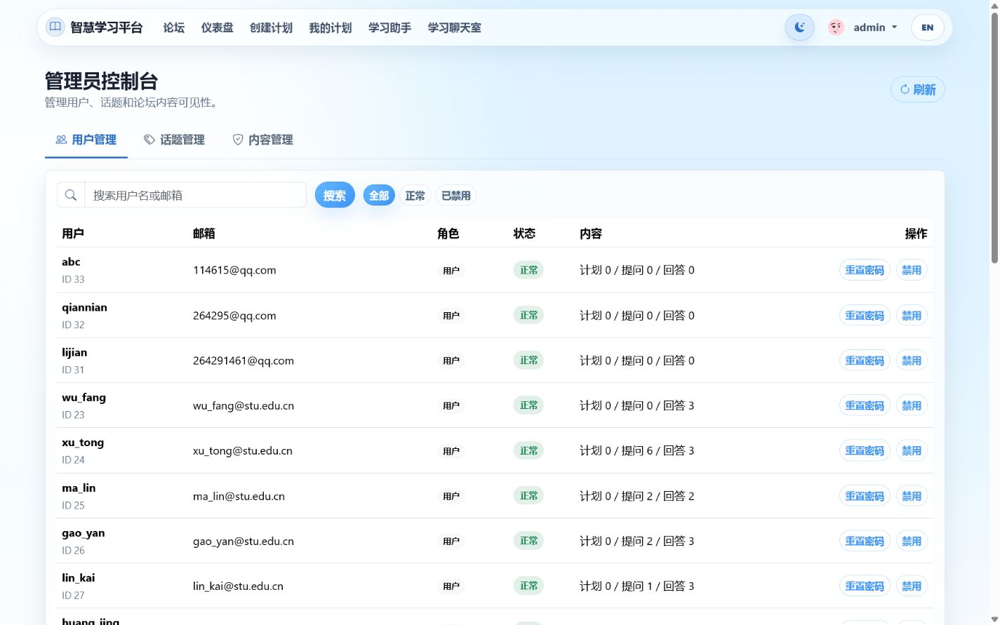
